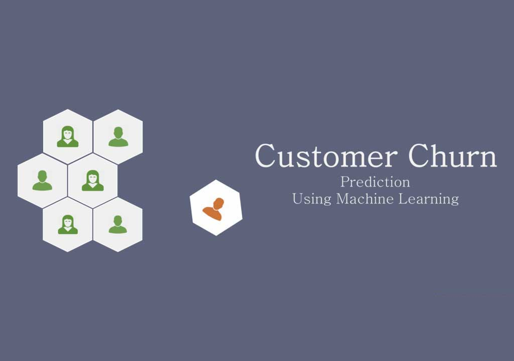

# Customer Churn Prediction



This project predicts **customer churn** using a **logistic regression model implemented from scratch**, and showcases **end-to-end ML deployment** with explainable AI and interactive dashboards. It demonstrates how a data scientist can design production-grade ML pipelines, APIs, and visualization dashboards.

---

## 🧩 Project Overview

- **Problem:** Predict whether a customer will churn based on historical data.
- **Data:** Features like `Age`, `Total_Purchase`, `Account_Manager`, `Years`, `Num_Sites`.
- **Model:** Custom logistic regression using **gradient descent**.
- **Evaluation:** Accuracy, ROC/AUC, Cross-validation metrics.
- **Explainability:** SHAP global and local explanations.
- **Deployment:** FastAPI endpoint + Streamlit dashboard hosted on Render.

---

## 🚀 Features

1. **Data Preprocessing**
   - Handles missing values and drops irrelevant columns.
   - Standardizes numerical features using `StandardScaler`.
   - Adds intercept term for logistic regression.

2. **Custom Logistic Regression**
   - Cost function and gradient descent implemented from scratch.
   - Model trained on training dataset with iterative convergence visualization.

3. **Model Evaluation**
   - Accuracy, ROC curve, AUC score.
   - K-Fold Cross-validation metrics for robustness.
   - Classification report and confusion matrix.

4. **Explainable AI**
   - SHAP **global summary plot** for feature importance across all customers.
   - SHAP **waterfall plot** for individual customer predictions.

5. **Interactive Dashboard**
   - Streamlit app for live predictions.
   - Displays model metrics and plots.
   - Offers optional API mode for remote predictions.

6. **Deployment**
   - **FastAPI:** Provides `/predict` endpoint for real-time predictions.
   - **Streamlit:** Interactive web dashboard.
   - Hosted on [Render](https://render.com).

---

## 🗂 Project Structure

```plaintext
root/
├── data/
│ ├── processed_customer_churn.csv
│ ├── new_customers_1.csv
│ └── customer_churn.csv
├── models/
│ ├── churn_model.pkl
│ └── churn_metrics.pkl
├── src/
│ ├── model.py # Model training and evaluation
│ ├── explain.py # SHAP explanations
│ └── train.py # Optional training script
├── api/
│ └── main.py # FastAPI endpoint
├── app/
│ └── app.py # Streamlit dashboard
├── customerChurn.ipynb
├── README.md
├── requirements.txt
└── start.sh
```

---

## 🛠 Technologies Used

- **Python 3**
- **Pandas & NumPy** for data manipulation
- **Matplotlib & SHAP** for visualization
- **Scikit-learn** for preprocessing, ROC/AUC, cross-validation
- **FastAPI** for model API
- **Streamlit** for dashboard
- **Render** for deployment

---

## ⚙️ How It Works

1. **Local Mode (Default)**
   - Loads `churn_model.pkl` and `churn_metrics.pkl`.
   - Uses the trained model for predictions and SHAP explanations instantly.

2. **API Mode (Optional)**
   - Set environment variable `API_URL` pointing to deployed FastAPI endpoint.
   - Dashboard sends POST requests to API for predictions.
   - Useful in production or multi-user scenarios.

---

## 📈 Dashboard Features

- **Model Metrics & Evaluation**
  - Accuracy, AUC, ROC curve
  - Cross-validation results
- **Prediction Form**
  - Input customer features
  - Predict churn probability
- **SHAP Plots**
  - Global feature importance (summary)
  - Individual customer explanation (waterfall)

---

## 💡 How to Run Locally


1. Clone the repo:

```plaintext
      git clone https://github.com/<your-username>/customer-churn-prediction.git
      cd customer-churn-prediction
```

2. Install dependencies:
```plaintext
      pip install -r requirements.txt
```

3. Run FastAPI API (optional):
```plaintext
      uvicorn src.main:app --reload
```
4. Run Streamlit Dashboard:

```plaintext
      streamlit run app/app.py
```
5. By default, it uses local pickle files.

```plaintext
      To use API mode, set environment variable API_URL
      export API_URL = your api url here
```
